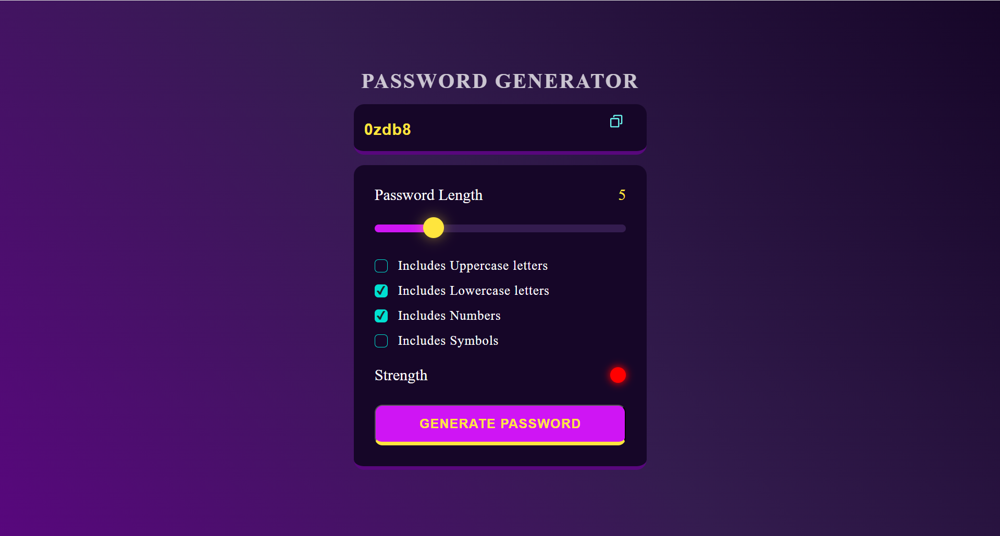
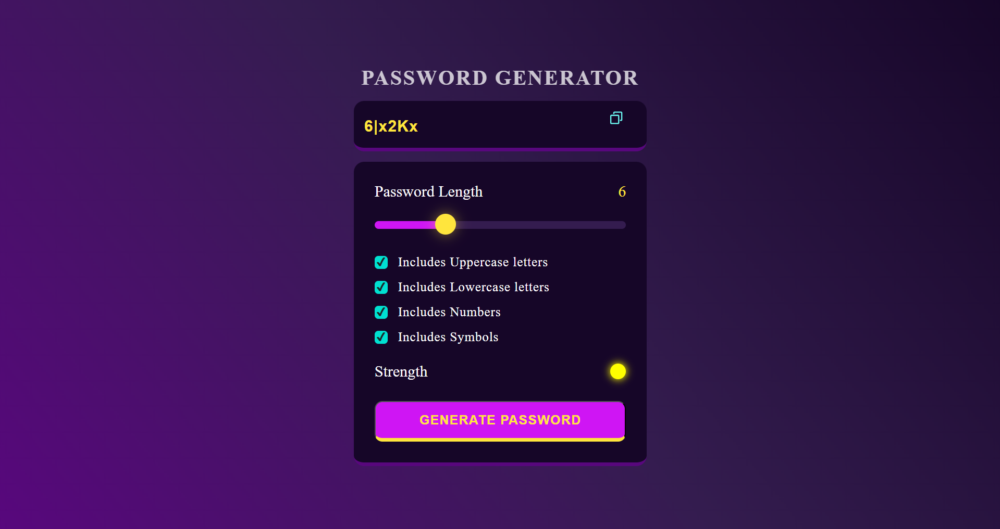
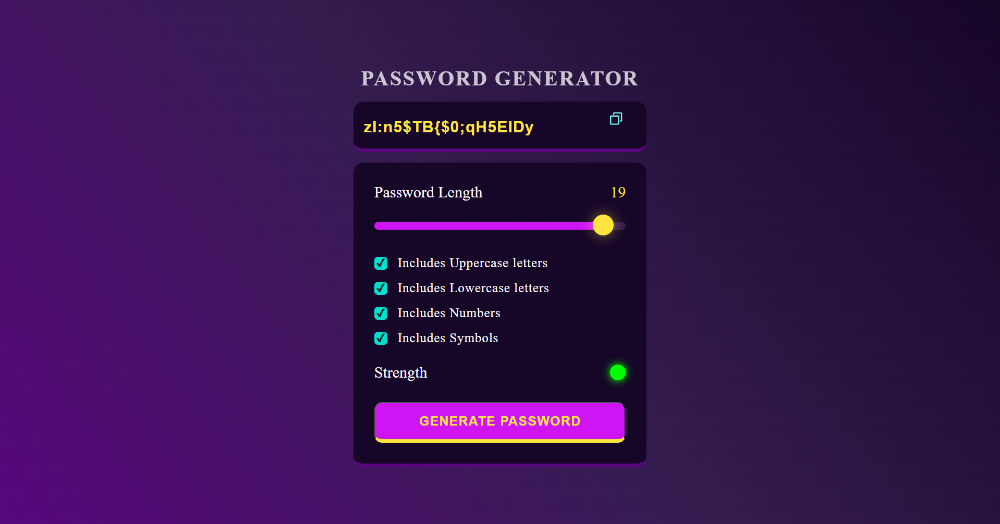

# 🔐 Password Generator

**Live Demo ➜** [Click here to try!]( https://shindenikhil8.github.io/Password_Generator.github.io/)  
> _Replace the above link with your actual GitHub Pages URL_

Welcome to my **responsive and customizable Password Generator** built with HTML, CSS, and JavaScript! Create strong, secure passwords based on your preferences and check their strength instantly.

---

## 🧩 Features

🛡️ **Customize Your Password**
- Include Uppercase, Lowercase, Numbers, Symbols
- Select password length (1 to 20)

📊 **Visual Strength Indicator**
- Shows real-time feedback (Low / Medium / High)
- Based on length and complexity

📋 **One-Click Copy**
- Easily copy the generated password
- Tooltip confirms "Copied!" message

🔁 **Smart Randomization**
- Ensures selected character types are included
- Fisher-Yates Shuffle for unpredictability

---

## 🖼️ Screenshots

<table>
  <tr>
    <td align="center">
      
      <br><em>Low Strength</em>
    </td>
    <td align="center">
      
      <br><em>Medium Strength</em>
    </td>
  </tr>
</table>
<p align="center">
  
<br><em>High Strength</em>
</p>


---

## 🛠️ Tech Stack

| Tech        | Role                                |
|-------------|-------------------------------------|
| `HTML`      | Page structure                      |
| `CSS`       | Styling, gradients, layout          |
| `JavaScript`| Password logic, event handling, UI  |

---

## 📁 File Structure

```
📦 password-generator/
├── password.html       # HTML structure
├── password.css        # CSS styles and themes
├── index.js         # JS logic for password creation and UI
├── copy.svg
└── Screenshots
    ├──low_level_password.jpg
    ├──medium_level_password.jpg
    └──high_level_password.jpg
```

---

## 🚀 Future Scope

- Light/Dark theme toggle  
- Save password history temporarily  
- Password strength score (entropy-based)

---

Feel free to ⭐ star this repo if you like it or want to contribute!
